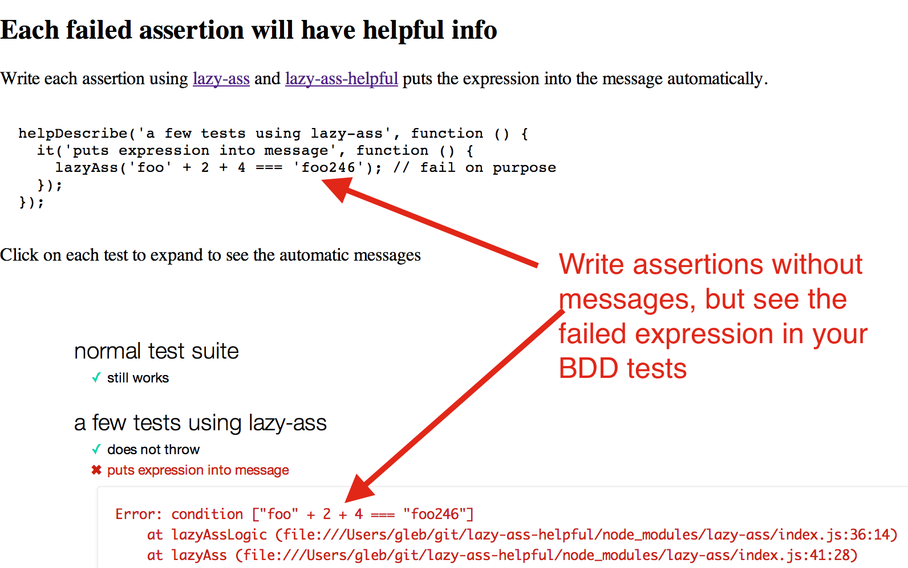

# lazy-ass-helpful

> lazy-ass plugin to automatically show helpful info for failed assertions

[Test page](http://glebbahmutov.com/lazy-ass-helpful/),
[test page BDD (mocha)](http://glebbahmutov.com/lazy-ass-helpful/index-mocha.html)

[![NPM][lazy-ass-helpful-icon]][lazy-ass-helpful-url]

[![Build status][lazy-ass-helpful-ci-image]][lazy-ass-helpful-ci-url]
[![dependencies][lazy-ass-helpful-dependencies-image]][lazy-ass-helpful-dependencies-url]
[![devdependencies][lazy-ass-helpful-devdependencies-image]][lazy-ass-helpful-devdependencies-url]

Stop writing assertion messages, let the automatic on the fly code rewriting
put the entire expression into the text message.

This package provides single function `lazyAssHelpful` that transforms any given function
with [lazy-ass assertions](https://github.com/bahmutov/lazy-ass) without extra info
into.

**Example:**

Typical code with assertions requires lots of extra stuff to be helpful, if
the condition is false.

```js
function doSomething(a) {
  lazyAss(typeof a === 'number', 'a should be a number', a);
  ...
}
doSomething('foo'); // Error: a shoud be a number 'foo'
```

*lazy-ass-helpful* allows you to skip writing text explanations in assertions

```js
function doSomething(a) {
  lazyAss(typeof a === 'number', a);
  ...
}
lazyAssHelpful(doSomething)('foo'); // Error: condition [typeof a === "number"] 'foo'
```

## install and use

node:

    npm install lazy-ass-helpful --save
    require('lazy-ass-helpful');

browser:

    bower install lazy-ass-helpful --save
    <script src="bower_components/lazy-ass-helpful-browser.js"></script>

use:

```js
function foo() {
  lazyAss(2 + 2 === 5);
}
var helpfulFoo = lazyAssHelpful(foo);
foo(); // Error: failed
helpfulFoo(); // Error: condition [2 + 2 === 5]
```

## Limitation

Because `lazyAssHelpful` rewrites and evals the given function, it no longer can access
the closure variables directly. Only global variables or local variables are allowed

```js
// local variables are ok
function foo() {
  var bar = 'bar';
  lazyAss(bar === 'something');
}
lazyAssHelpful(foo)();
// global variables are ok
window.bar = 'bar';
function foo() {
  lazyAss(window.bar === 'something');
}
lazyAssHelpful(foo)();
// closure variables are NOT ok
bar bar = 'bar';
function foo() {
  lazyAss(bar === 'something');
}
lazyAssHelpful(foo)(); // ReferenceError: bar is undefined
```

## lazy-ass-helpful-bdd

I include [lazy-ass-helpful-bdd.js](lazy-ass-helpful-bdd.js) that wraps the common BDD
functions `describe` and `it` into `helpDescribe` and `helpIt`. These functions
transform the unit test code using `lazyAssHelpful` method.

Typical setup:

```html
<script src="node_modules/mocha/mocha.js"></script>
<script>mocha.setup('bdd')</script>
<script src="node_modules/lazy-ass/index.js"></script>
<script src="lazy-ass-helpful-browser.js"></script>
<script src="lazy-ass-helpful-bdd.js"></script>
<script src="test/test-bdd.js"></script>
<script>
  mocha.run();
</script>
```

The write unit test wrapped in `helpDescribe` function using `lazyAss` assertions.
If an assertion fails, there will be helpful context.



I also have same project optimized for QUnit assertions rewriting, see
[qunit-helpful](https://github.com/bahmutov/qunit-helpful)

## How?

`lazyAssHelpful` rewrites the given function using [falafel](https://www.npmjs.org/package/falafel),
and then returns a new function with every `lazyAss(condition, ...)` replaced with
`lazyAss(condition, 'condition source', ...)`.

## Small print

Author: Gleb Bahmutov &copy; 2014 @bahmutov

License: MIT - do anything with the code, but don't blame me if it does not work.

Support: if you find any problems with this module, email / tweet / open issue on Github

[lazy-ass-helpful-icon]: https://nodei.co/npm/lazy-ass-helpful.png?downloads=true
[lazy-ass-helpful-url]: https://npmjs.org/package/lazy-ass-helpful
[lazy-ass-helpful-ci-image]: https://travis-ci.org/bahmutov/lazy-ass-helpful.png?branch=master
[lazy-ass-helpful-ci-url]: https://travis-ci.org/bahmutov/lazy-ass-helpful
[lazy-ass-helpful-dependencies-image]: https://david-dm.org/bahmutov/lazy-ass-helpful.png
[lazy-ass-helpful-dependencies-url]: https://david-dm.org/bahmutov/lazy-ass-helpful
[lazy-ass-helpful-devdependencies-image]: https://david-dm.org/bahmutov/lazy-ass-helpful/dev-status.png
[lazy-ass-helpful-devdependencies-url]: https://david-dm.org/bahmutov/lazy-ass-helpful#info=devDependencies
[endorse-image]: https://api.coderwall.com/bahmutov/endorsecount.png
[endorse-url]: https://coderwall.com/bahmutov
